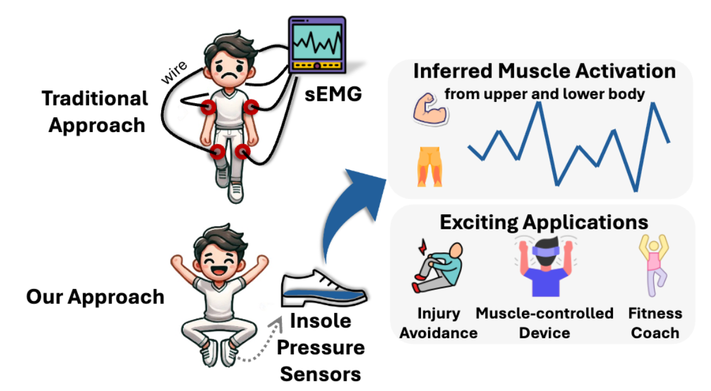
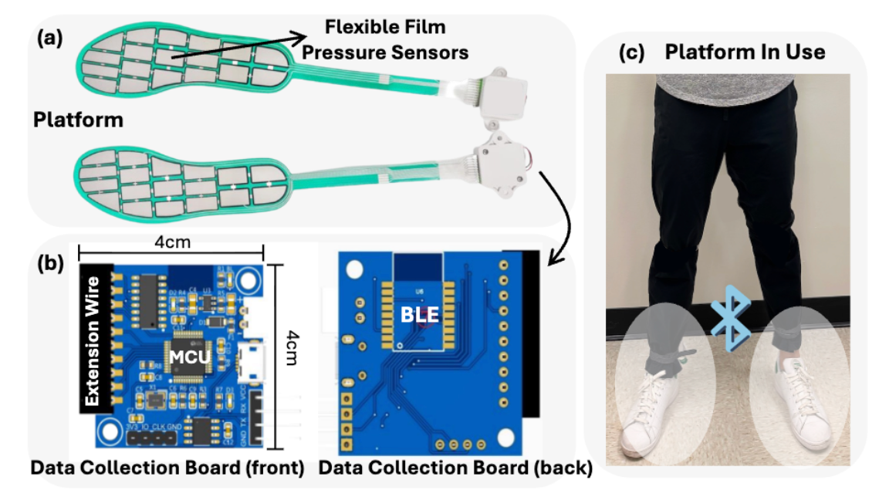

## Press2Muscle Codebase

### Exploring the Feasibility of Full-Body Muscle Activation Sensing with Insole Pressure Sensors (MobiCom'26)


 In contrast to traditional methods, Press2Muscle provides an unobtrusive and scalable solution for accurate full-body muscle activation monitoring with pressure insoles, unlocking broad applications in health and fitness


### Setup

##### 0. Environment Setup

##### 1. Preparing Datasets

Augmenting original dataset N (e.g., 3) times:

`python -m dataset.augmentation --id augment1`

`python -m dataset.augmentation --id augment2`

`python -m dataset.augmentation --id augment3`

(only partial data is released)

##### 2. Creating Protocol (train.test splits)

E.g., creating leave-one-subject-out protocol for user-12 by
`python -m dataset.create_split -p user-12`

Train, val and test files are now stored in `datasets/protocols/user-12_*.txt`


##### 3. Preparing Config

in `cfg/user/user-12.yaml`, update `PROTOCOL` to `user-12`
similar for other users.


##### 4. Training 
`python full_train.py --cfg cfg/user/user-12.yaml -e full-user12`


### TODOs
- [x] release code
- [ ] detailed comments and explanations for the codebase
- [ ] reorg all dataset


### Platform


 (a) The platform consists of multiple flexible film pressure sensors from two feet (b) with compact data collection boards that support wireless data streaming. (c) The platform can be seamlessly inserted into shoes with negligible impact on users’ appearance and movements.


### Citing Press2Muscle 

Please cite our paper if you find it helpful

```
@inproceedings{zhou2026exploring,
  title={Exploring the Feasibility of Full-Body Muscle Activation Sensing with Insole Pressure Sensors},
  author={Zhou, Hao and Gowda, Mahanth },
  booktitle={The 32th Annual International Conference on Mobile Computing and Networking (ACM MobiCom '26)},
  year={2026},
}
```
